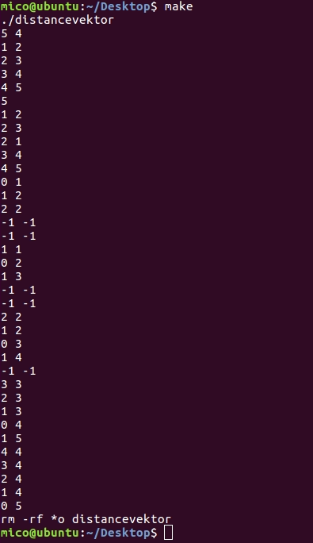
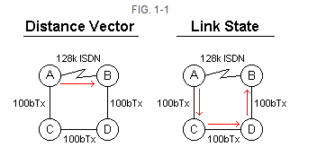

### Tugas Besar 2 IF-3130 Jaringan Komputer (Distance Vector Simulation)

#### **Petunjuk Penggunaan Program** 
1. Pindah ke dalam folder *src*
2. Buka *cmd*
3. Jalankan program dengan mengetik perintah " ***`make`*** " pada *cmd*
4. Program sekarang berjalan dan dapat menerima inputan, inputannya terdiri atas :
    > 1. n_node
    > 2. jumlah koneksi antar-node yang terjadi
    > 3. jumlah skenario pengiriman data
5. Program kemudian akan menampilkan semua *distance* dan *next hope* antar setiap *node*, contoh jika terdapat 3 *node* berarti akan ada 9 baris inputan yang keluar.

#### **Simulasi Program**

> Prosedur kerja Program:
>  1. **Simulasi sebuah node :**
>
> ***`Node`*** pada program ini memiliki 2 komponen, yaitu komponen ***`distance`*** dan komponen ***`next_hop`*** . komponen *distance*  menyimpan jarak dari *node* itu sendiri ke *node* lainnya. Komponen ***`next_hop`*** menyimpan ***`next_hop`*** dari suatu *node* untuk ke *node* lainnya. Kedua komponen ini di *assign* dengan nilai -1 jika belum dihubungkan ke *node* manapun. *Assign* nilai tersebut dilakukan oleh fungsi ***`initiate_tabel[int n_node]`*** . Setelah inisiasi tabel, akan dilakukan pemanggilan ***`connect_node[int edge]`*** yang berfungsi untuk menghubungkan *edge* nya.
>
> Contohnya : terdapat sebuah ***`node_i`*** , memiliki 2 komponen yaitu matriks ***`distance_tabel[i][0-999]`*** dan ***`next_hop_tabel[i][0-999]`*** .
> 
> 2. **Pengiriman pesan pada simulasi :**
>
> Ketika sebuah informasi ingin dikirim, program akan melakukan pemanggilan fungsi ***`update_table[int i]`*** yang akan melakukan update pada kedua tabel komponen tujuan.
>
> **Contoh** : 
>
>Ketika ***`node_2`*** mengirim pesan ke ***`node_3`*** , maka akan dilakukan *update* dua komponen yang dimiliki ***`node_3`*** (*node* tujuan). 
>Untuk pengecekan dilakukan ke semua komponen dari *node* yang saling berkaitan, berarti akan dilakukan pengecekan pada seluruh ***`distance_tabel[node_3][0-999]`*** dan ***`next_hop_tabel[node_3][0-999]`*** kemudian dibandingkan dengan komponen ***`distance_tabel[node_2][0-999]`*** dan ***`next_hop_tabel[node_2][0-999]`*** yang akan di *update*.
>
>Update hanya dilakukan pada komponen dari *node* tujuan, pada kasus ini ***`node_3`*** .
>
> 3. **struktur data yang dipakai :** 
>
> Dua buah matriks yaitu :
> - ***`int distance_tabel[1000][1000]`*** mensimulasikan tabel jarak
> - ***`int next_hop_tabel[1000][1000]`*** mensimulasikan tabel next_hoop
> 

#### **Menjawab Pertanyaan**
##### Apakah perbedaan dari routing protocol distance-vector dan link state? Manakah yang lebih baik untuk digunakan?
**Perhatikan gambar di bawah **. Jika semua router yang menjalankan protokol distance vector, jalur atau route yang dipilih akan dari A B langsung melalui link serial ISDN, meskipun link tersebut sekitar 10 kali lebih lambat dari rute langsung A C D B.

Protokol link state akan memilih jalur A B C D karena menggunakan media yang lebih cepat (sekitar 100 Mb ethernet). dalam contoh ini, akan lebih baik untuk menjalankan suatu routing protokol link state, tetapi jika semua link di jaringan kecepatannya sama, maka protokol distance vector akan lebih baik.

Secara Garis besar perbedaan antara *Distance Vector* dan *Link State* adalah sebagai berikut :
**Distance Vector**
1. Protocol routing yang menitik beratkan pada jarak dan arah. didalam melakukan pemutusan routing terdekat ditentukan pada jarak dan arah terdekat (Hop Count). 
2. Setiap router akan mengirimkan routing table ke router terdekat tanpa mengetahui topologi/ bagaimana mereka terkoneksi. distance vector tidak mampu melihat topologi yang ada dibelakang network terdekatnya.
3. Update dikirim setiap 30 detik yang bisa menyebabkan cpu load dalam router itu tinggi, selain CPU load itu tinggi juga memakan bandwidth yang besar. secara default distance vector merupakan classfull IP.

**Link State**
1. Protocol routing yang menitik beratkan pada perhitungan metric cost
2. Dalam routing link-state router-router akan melakukan pertukaran informasi antar jaringan dan membangun topologi table. 
3. Setiap router akan menggunakan Djikstra's algorithm untuk menghitung route terbaik dalam setiap tujuannya. 

##### Pada implementasinya saat ini manakah yang lebih banyak digunakan, distance-vector atau  link state? Kenapa?
Pada implementasi saat ini, jaringan skala kecil masih lebih banyak menggunakan *Distance Vector* karena lebih mudah dalam pemeliharaan dan konfigurasi.

Sedangkan untuk jaringan skala besar lebih banyak menggunakan *link state* karena sifatnya yang dapat menentukan *shortest path* dengan lebih baik karena menerapkan algoritma Djikstra.

